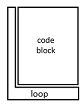
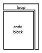

Java Loop While (doWhile and While)
===================================

Example Application: LOOP - doWhile and while

# Loop Structure

## Do While



```java
do {
 // code block to be executed in loop
} while (condition);
```

## While



```java
while (condition) {
 // code block to be executed in loop
}
```


## Some links for more in depth learning

* [JAVA PRINT](https://github.com/fefong/java_print);
* [JAVA SWITCH CASE](https://github.com/fefong/java_switch);
* [JAVA IF/ELSE](https://github.com/fefong/java_ifElse);
* [JAVA ARITHMETIC](https://github.com/fefong/java_calculator);

* [JAVA](https://github.com/search?q=fefong%2Fjava)
